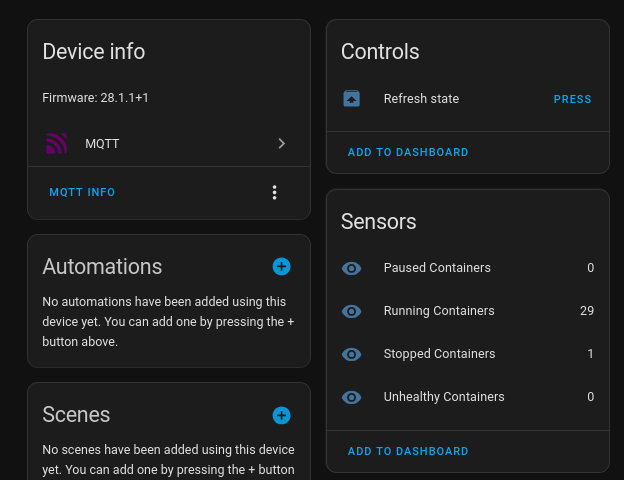
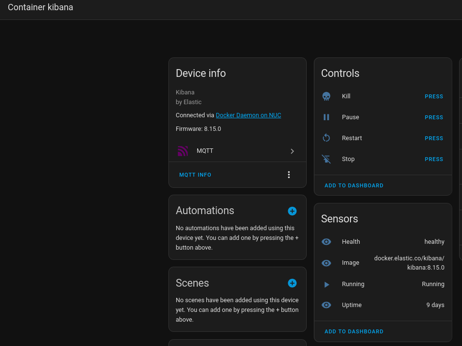

# Docker Control for Home Assistant

This application allows you to monitor and control Docker containers from Home Assistant using MQTT discovery.

It's built on top of my [ha-mqtt-discoverable](https://github.com/Ginden/node-ha-mqtt-discoverable) library, which provides a simple way to create MQTT-discoverable entities in Home Assistant.

## Features

- **Container Discovery:** Automatically discovers running Docker containers and creates corresponding entities in Home Assistant.
- **Container Control:** Start, stop, and restart containers from the Home Assistant UI.
- **Real-time Monitoring:** Get real-time status updates for your containers, including uptime and state.
- **Daemon Information:** Exposes information about the Docker daemon itself as a device in Home Assistant.

## Screenshots

*Main daemon view in Home Assistant:*



*Container controls:*



## Configuration

The application is configured using environment variables. You can either pass them directly to the Docker container or use a `.env` file.

You can use the provided [`./.env.full.example`](./.env.full.example) or [`./.env.minimal.example`](./.env.minimal.example) files as a starting point. Simply copy one of them to `.env` and customize the values.

By default, the application will look for a `.env` file in the root of the project. You can use the `CUSTOM_CONFIG_PATH` environment variable to specify a different path.

Below is a list of all available options:

| Variable | Description | Default |
| --- | --- | --- |
| `MQTT_HOST` | The hostname of your MQTT broker. | | 
| `MQTT_PORT` | The port of your MQTT broker. | `1883` |
| `MQTT_USERNAME` | The username for your MQTT broker. | | 
| `MQTT_PASSWORD` | The password for your MQTT broker. | | 
| `DOCKER_SOCKET_PATH` | The path to the Docker socket. | `/var/run/docker.sock` |
| `LOG_LEVEL` | The log level for the application. | `info` |
| `HA_DISCOVERY_PREFIX` | The Home Assistant discovery prefix. | `homeassistant` |
| `HA_DEVICE_ID_PREFIX` | The prefix for the device IDs in Home Assistant. | `dcha_` |
| `POLLING_INTERVAL` | The interval in milliseconds at which to poll the Docker daemon. | `10000` |
| `ENABLE_CONTROL` | Whether to enable container control from Home Assistant. | `false` |
| `INCLUDE_DEAD_CONTAINERS` | Whether to include dead containers in the discovery. | `false` |
| `REQUIRE_LABEL_TO_EXPOSE` | A label that must be present on a container for it to be exposed to Home Assistant. | | 
| `EXPOSE_DAEMON_INFO` | Whether to expose information about the Docker daemon. | `true` |
| `DAEMON_CONTROLLER_NAME` | The name of the Docker daemon device in Home Assistant. | `Docker Daemon` |
| `UPTIME_MEASURE_TYPE` | The unit of measurement for container uptime. | `human` |
| `CUSTOM_CONFIG_PATH` | The path to a custom configuration file. See [Configuration file](#configuration-file) for more details. | |

## Docker Compose Example

Here is a sample [`docker-compose.yml`](./docker-compose.example.yml) file to run the application:

```yaml
services:
  docker-control-ha:
    image: ghcr.io/ginden/docker-control-ha
    container_name: docker-control-ha
    restart: unless-stopped
    environment:
      MQTT_HOST: localhost
      MQTT_PORT: 1883
      # MQTT_USERNAME: user
      # MQTT_PASSWORD: password
      DOCKER_SOCKET_PATH: /var/run/docker.sock
      ENABLE_CONTROL: "true"
      EXPOSE_DAEMON_INFO: "true"
      LOG_LEVEL: warn
      # These are important (!!!) so your entity IDs are stable across restarts
      HA_DEVICE_ID_PREFIX: "docker_your_name_"
      DAEMON_CONTROLLER_NAME: "Docker Daemon on LocalServer"

    volumes:
      - /var/run/docker.sock:/var/run/docker.sock
```

By default, container runs as `root` user which is required to access the Docker socket. If you want to run it as a different user, you need to specify the `user` option in the `docker-compose.yml` file.

```yaml
    user: "1000:1000"  # Replace with your user and group ID
    group_add:
      - "1000"  # Replace with your group ID (`getent group docker` to find out)
```

### Rootless Docker

To find out location of the Docker socket in rootless mode, you can run the following command:

```bash
docker context inspect | jq '.[].Endpoints.docker.Host' -r
```


## Running the Application

### Docker Compose

1.  Create a `docker-compose.yml` file based on the example above.
2.  Customize the environment variables to match your setup.
3.  Run `docker-compose up -d` to start the application in the background.

### Docker Run (minimal example)

For a quick test, you can run the container directly using `docker run`:

```bash
docker run \
  --rm \
  --name docker-control-ha \
  -v /var/run/docker.sock:/var/run/docker.sock \
  -e MQTT_HOST=your_mqtt_broker_ip \
  ghcr.io/ginden/docker-control-ha
```

Replace `your_mqtt_broker_ip` with the IP address or hostname of your MQTT broker.


## Configuration file

If you want to use a custom configuration file, you can specify its path using the `CUSTOM_CONFIG_PATH` environment variable. The file should be a `.env` file.

Example `config.env`:

```dotenv
MQTT_HOST=localhost
MQTT_PORT=1883
```

Then, you can run the application with:

```bash
docker run -e CUSTOM_CONFIG_PATH=/app/config.env -v /path/to/your/config.env:/app/config.env your-image-name
```


## Exposed Entities

This application will create the following entities in Home Assistant:

### Container Entities

For each discovered Docker container, a new device is created with the following entities:

- **Running:** A binary sensor that indicates whether the container is running.
- **Uptime:** A sensor that shows the uptime of the container.
- **Health:** A sensor that shows the health status of the container.
- **Image:** A sensor that shows the image the container is using.
- **Restart:** A button to restart the container.
- **Pause:** A button to pause the container.
- **Kill:** A button to kill the container.
- **Stop:** A button to stop the container.
- **Start:** A button to start the container (only if `INCLUDE_DEAD_CONTAINERS` is `true`).

### Daemon Entities

If `EXPOSE_DAEMON_INFO` is set to `true`, a device is created for the Docker daemon with the following entities:

- **Running Containers:** A sensor that shows the number of running containers.
- **Paused Containers:** A sensor that shows the number of paused containers.
- **Stopped Containers:** A sensor that shows the number of stopped containers.
- **Unhealthy Containers:** A sensor that shows the number of unhealthy containers.

If `ENABLE_CONTROL` is set to `true`, the following control entities are created for the daemon:

- **Refresh state:** A button to manually trigger a refresh of all container states.

## Development

To run the application in a development environment:

1.  Clone the repository.
2.  Install dependencies with `npm install`.
3.  Run the application with `npm start`.

## License

This project is licensed under the MIT License - see the [LICENSE](LICENSE) file for details.
